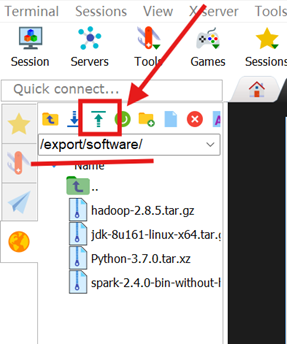
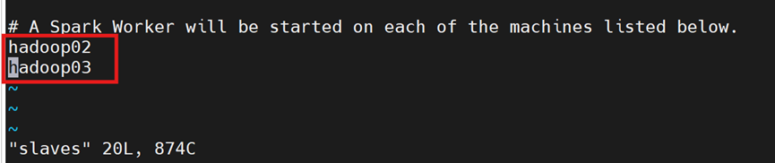
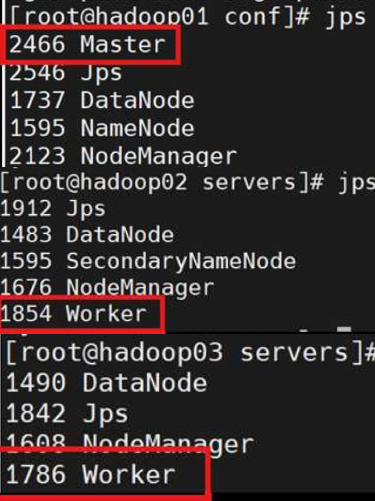
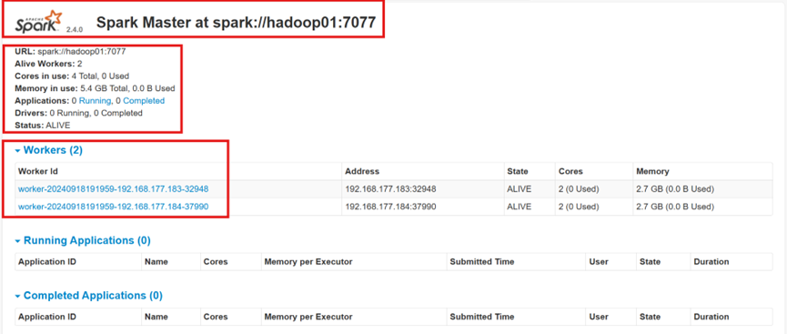
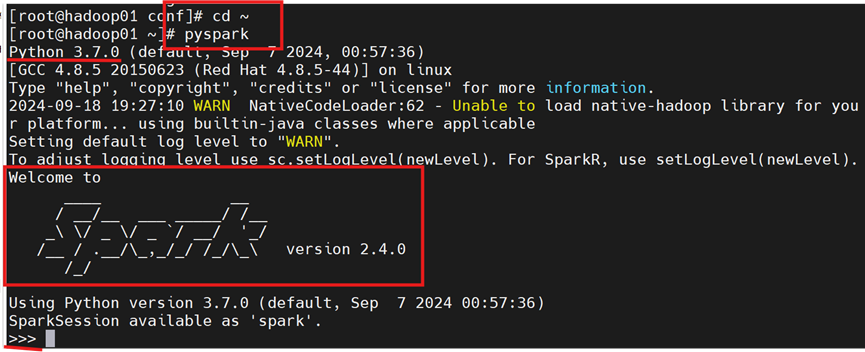

# 1.3 Spark安装与配置
在此使用的是**Spark on YARN**的部署模式

默认在01主节点中操作，除非有特别说明

## 1.3.1 将spark压缩包上传虚拟机
在主节点中将spark-2.4.0-bin-without-hadoop.tgz上传至虚拟机中（这里使用的是MobaXterm)



## 1.3.2 解压缩、重命名
```bash
cd /export/software
tar -zxvf spark-2.4.0-bin-without-hadoop.tgz -C /export/servers
cd /export/servers/
ll -a
mv spark-2.4.0-bin-without-hadoop/ spark  
//重命名为spark
```

## 1.3.3 修改相关配置
### Step 1：修改spark-env.sh
先将`spark-env.sh`原文件复制备份而后再修改

```bash
cd /export/servers/spark/conf
cp spark-env.sh.template spark-env.sh
# 复制备份模板文件spark-env.sh.template为spark-env.sh
vi spark-env.sh
```

在`spark-env.sh`文件**顶部**编辑如下内容

```bash
#*******************************Spark*******************************
export SPARK_DIST_CLASSPATH=$(/export/servers/hadoop/bin/hadoop classpath)
export JAVA_HOME=/export/servers/jdk
export HADOOP_HOME=/export/servers/hadoop
export SPARK_HOME=/export/servers/spark
export PATH=$PATH:$SPARK_HOME/bin:$SPARK_HOME/sbin
export PYTHONPATH=$SPARK_HOME/python:$SPARK_HOME/python/lib/py4j-0.10.7-src.zip:$PYTHONPATH
export PYSPARK_PYTHON=python3
export PATH=$HADOOP_HOME/bin:$SPARK_HOME/bin:$PATH
export SPARK_MASTER_HOST=hadoop01
#这里设置01为Master
export SPARK_MASTER_PORT=7077
#设置主服务器的端口号为7077
```

修改后执行生效命令

```bash
source spark-env.sh
```

### Step 2：配置slaves
先将`slaves`原文件复制备份而后再修改

```bash
cd /export/servers/spark/conf
ll -a
# 查询slaves文件
cp slaves.template slaves
# 备份重命名slaves.template为slaves
vi slaves
```

在`slaves`文件中设置spark集群的slaves节点，编辑slaves文件的内容，把默认内容localhost换成如下图内容



修改后执行生效命令

```bash
source slaves
```

### Step 3：重命名spark启动/关闭命令
由于HDFS中已含有start-all.sh、stop-all.sh的启动命令，Spark中原有的这两条命令就不宜继续使用，为避免指令冲突，重命名spark中的这两条命令

```bash
cd /export/servers/spark/sbin
mv start-all.sh start-spark-all.sh
#重命名Spark集群启动命令
mv stop-all.sh stop-spark-all.sh
#重命名Spark集群关闭命令
```

### Step 4：分发给从节点
将配置好的Spark发送到另外两台虚拟机02、03上

```bash
scp -r /export/servers/spark root@hadoop02:/export/servers/
scp -r /export/servers/spark root@hadoop03:/export/servers/
```

## 1.3.4 修改profile
**分别在01、02、03**上修改`/etc/profile`

```bash
vi /etc/profile
```

分别执行3次在01/02/03中输入下列相同配置内容，并执行:wq保存退出

```bash
# ****************Spark**********************
export SPARK_HOME=/export/servers/spark
export PATH=$SPARK_HOME/bin:$SPARK_HOME/sbin:$PATH
```
在01、02、03上分别使`profile`生效

```bash
source /etc/profile
```

## 1.3.4 检查是否安装成功
检查基于Yarn模式的spark集群是否安装成功，启动HDFS、YARN、Spark集群，使用spark集群jps进程查询

```bash
start-dfs.sh			  //启动hadoop集群的HDFS服务进程
start-yarn.sh		    //启动hadoop集群的YARN服务进程
start-spark-all.sh	//启动基于YARN模式的Spark集群
```
 在01、02、03中分别执行以下命令，显示进程如下图

 ```bash
jps
```



**注意**：01的6个进程，02的5个进程，03的4个进程都缺一不可

## 1.3.5 在浏览器上访问Spark
在Master主机上打开浏览器，访问http://hadoop01:8080查看spark集群信息

或

在本机电脑浏览器中，访问http://主节点IP:8080查看spark集群信息



## 1.3.6 检查是否正常运行
在主节点01会话中，查询基于python语言的spark交互式编程环境能否正常运行

```bash
pyspark
```



## 1.3.7 退出集群
至此，Spark安装成功啦！在主节点中输入退出集群的命令

```bash
stop-spark-all.sh
stop-dfs.sh
stop-yarn.sh
```

