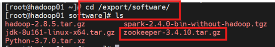
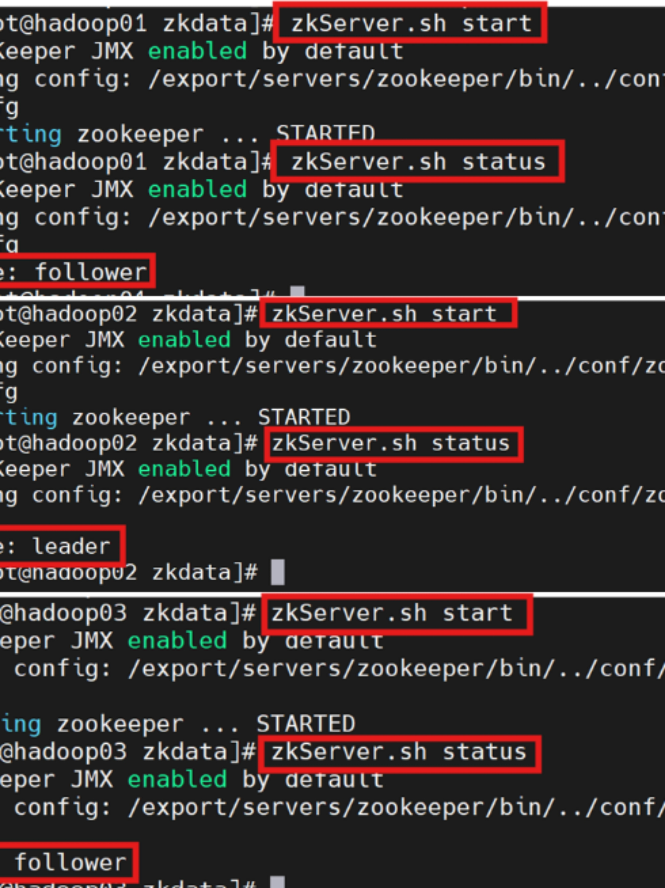

# 3.1 Zookeeper分布式协调服务(Python版)

HBase 中存储在HDFS中的数据是通过Zookeeper分布式协调服务调度器来进行协调处理的。

因此在安装HBase之前,先要进行Zookeeper的安装、分布式集群配置,这样后期HBase遇到的单点故障和集群主节点宕机等问题,就可以使用Zookeeper部署的高可用HBase集群进行处理。

## 3.1.1 Zookeeper安装
在01主服务器上将zookeeper安装包上传到linux系统`/export/software/`目录下，查询该目录下的最新结果。



解压安装包文件到`/export/servers`目录，并将其重命名

```bash
tar -zxvf zookeeper-3.4.10.tar.gz -C /export/servers/
cd /export/servers/
mv zookeeper-3.4.10/ zookeeper
```

## 3.1.2 Zookeeper配置

### Step 1:zoo.cfg
进入Zookeeper解压目录下的`conf`目录，复制配置文件`zoo_sample.cfg`并重命名为`zoo.cfg`

```bash
cd /export/servers/zookeeper/conf
cp zoo_sample.cfg zoo.cfg
vi zoo.cfg
```

修改配置文件`zoo.cfg`:分别设置dataDir目录，配置服务器编号与主机号映射关系，设置与主机连接的心跳端口和选举端口。

```bash
# The number of milliseconds of each tick
tickTime=2000
# The number of ticks that the initial 
# synchronization phase can take
initLimit=10
# The number of ticks that can pass between 
# sending a request and getting an acknowledgement
syncLimit=5
# the directory where the snapshot is stored.
# do not use /tmp for storage, /tmp here is just 
# example sakes.
dataDir=/export/data/zookeeper/zkdata
# the port at which the clients will connect
clientPort=2181
# the maximum number of client connections.
# increase this if you need to handle more clients
# maxClientCnxns=60
#
# Be sure to read the maintenance section of the 
# administrator guide before turning on autopurge.
#
# http://zookeeper.apache.org/doc/current/zookeeperAdmin.html#sc_maintenance
#
# The number of snapshots to retain in dataDir
#autopurge.snapRetainCount=3
# Purge task interval in hours
# Set to "0" to disable auto purge feature
#autopurge.purgeInterval=1

server.1=hadoop01:2888:3888
server.2=hadoop02:2888:3888
server.3=hadoop03:2888:3888
```

### Step 2:创建myid文件
配置`zoo.cfg`中设置的dataDir目录，创建`zkdata`文件夹

```bash
mkdir -p /export/data/zookeeper/zkdata
```

在`zkdata`文件夹创建`myid`文件:

该myid文件里面的内容就是服务器编号

(hadoop01服务器对应编号1，hadoop02服务器对应编号2，hadoop03服务器对应编号3）其中`echo 1`中的1表示服务器的编号

```bash
cd /export/data/zookeeper/zkdata
echo 1 > myid
```

### Step 3:配置环境
修改配置环境变量`profile`文件

```bash
# /etc/profile
# ***************Zookeeper*******************
export ZK_HOME=/export/servers/zookeeper
export PATH=$PATH:$JAVA_HOME/bin:$HADOOP_HOME/bin:$HADOOP_HOME/sbin:$ZK_HOME/bin
```

### Step 4:分发相关文件至其他服务器
将01主服务器中的Zookeeper安装目录分发至hadoop02和hadoop03服务器，在01主服务器中执行:

```bash
scp -r /export/servers/zookeeper/ hadoop02:/export/servers/
scp -r /export/servers/zookeeper/ hadoop03:/export/servers/
```

将`myid`文件分发至hadoop02和hadoop03服务器

```bash
scp -r /export/data/zookeeper/ hadoop02:/export/data/
scp -r /export/data/zookeeper/ hadoop03:/export/data/
```

修改`myid`中的文件内容，依次对应服务器编号，分别为`2`和`3`

在hadoop01中分发`profile`文件给hadoop02和hadoop03

```bash
scp /etc/profile hadoop02:/etc/profile
scp /etc/profile hadoop03:/etc/profile
```

在各个服务器中执行环境变量使其生效

```bash
source /etc/profile
```

集群部署完成!!

## 3.1.3 Zookeeper集群服务的启动与关闭
依次在hadoop01、hadoop02、hadoop03服务器上启动Zookeeper服务器

```bash
zkServer.sh start
zkServer.sh status
```

再逐一查看zookeeper角色

```bash
zkServer.sh status
```



如图显示zookeeper已成功启动，并显示hadoop01在zookeeper中的角色是follower。

注意有时候也有可能是leader

至此，Zookeeper的leader+follower模式集群部署成功实现！

依次在hadoop01、hadoop02、hadoop03服务器上关闭Zookeeper服务器

```bash
zkServer.sh stop
```
