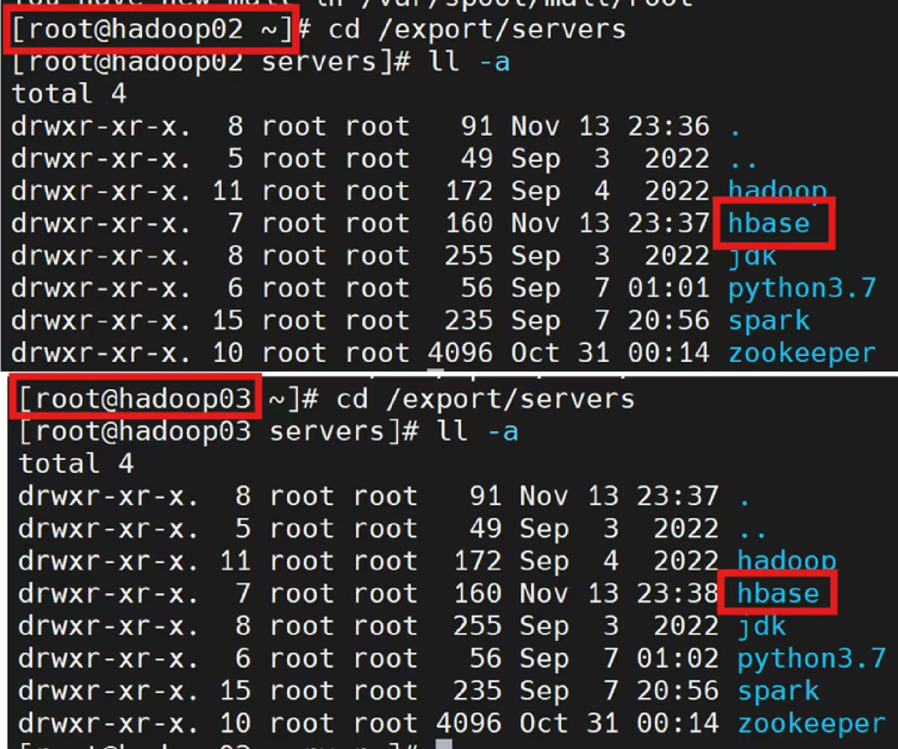

# 3.2 HBase安装及集群配置
HBase数据库是基于**列**进行的数据的存储，可以随着存储数据的不断增加而实时动态的增加列，从而满足Spark计算框架可以实时地将处理好的数据存储到Hbase数据库中的需求。

## 关于HBase
- HBase是一个稀疏、多维度、排序的映射表,这张表的索引是*行键、列族、列限定符和时间戳* 。
- 每个**值**是一个未经解释的字符串,没有数据类型。
- 用户在表中存储数据,每一行都有一个可排序的行键和任意多的列。
- **表**在水平方向由一个或者多个列族组成,一个列族中可以包含任意多个列,同一个列族里面的数据存储在一起。
- **列族**支持动态扩展,可以很轻松地添加一个列族或列,无需预先定义列的数量以及类型,所有列均以字符串形式存储,用户需要自行进行数据类型转换。
- HBase中执行更新操作时,并不会删除数据旧的版本,而是生成一个新的版本,旧有的版本仍然保留(这是和HDFS只允许追加不允许修改的特性相关的)。
- **表**:HBase采用表来组织数据,表由行和列组成,列划分为若干个列族。
- **行**:每个HBase表都由若干行组成,每个行由行键(row key)来标识。
- **列族**:一个HBase表被分组成许多“列族”(Column Family)的集合,它是基本的访问控制单元。
- **列限定符**:列族里的数据通过列限定符(或列)来定位。
- **单元格**:在HBase表中,通过行、列族和列限定符确定一个“单元格”(cell),单元格中存储的数据没有数据类型,总被视为字节数组 byte[]。
- **时间戳**:每个单元格都保存着同一份数据的多个版本,这些版本采用时间戳进行索引。
- HBase中存储在HDFS中的数据是通过Zookeeper分布式协调服务调度器来进行协调处理的

## 3.2.1 HBase安装
下载hbase-1.2.1-bin.tar.gzHBase安装包，并将其上传到hadoop01主服务器的`/export/software/`目录中

进入`/export/software`目录将其解压到`/export/servers`中，并改名为hbase

```bash
tar -zxvf hbase-1.2.1-bin.tar.gz -C /export/servers/
cd /export/servers/
mv hbase-1.2.1/ hbase
```

## 3.2.2 相关配置文件
先将`/export/servers/hadoop/etc/hadoop`目录中的`hdfs-site.xml`和`core-site.xml`配置文件复制一份到`/export/servers/hbase/conf`目录下

```bash
cp /export/servers/hadoop/etc/hadoop/{hdfs-site.xml,core-site.xml} /export/servers/hbase/conf
```

现在进入`/export/servers/hbase/conf`目录，修改5项相关配置文件`hbase-env.sh`、`hbase-site`、`regionservers`、`ackup-masters`、`profile`

### Step 1:修改hbase-env.sh
指定JDK的环境变量并配置Zookeeper（默认使用内置Zookeeper服务）

```bash
cd /export/servers/hbase/conf
vi hbase-env.sh
```

找到需要修改的地方

```bash
# hbase-env.sh
# ......
# The java implementation to use.  Java 1.7+ required.
export JAVA_HOME=/export/servers/jdk
# ......
# Extra Java runtime options.
# Below are what we set by default.  May only work with SUN JVM.
# For more on why as well as other possible settings,
# see http://wiki.apache.org/hadoop/PerformanceTuning
export HBASE_OPTS="-XX:+UseConcMarkSweepGC"

# Configure PermSize. Only needed in JDK7. You can safely remove it for JDK8+
export HBASE_MASTER_OPTS="$HBASE_MASTER_OPTS -XX:PermSize=128m -XX:MaxPermSize=128m"
export HBASE_REGIONSERVER_OPTS="$HBASE_REGIONSERVER_OPTS -XX:PermSize=128m -XX:MaxPermSize=128m"
# ......
# Uncomment and adjust to keep all the Region Server pages mapped to be memory resident
#HBASE_REGIONSERVER_MLOCK=true
#HBASE_REGIONSERVER_UID="hbase"
# ......
# Tell HBase whether it should manage it's own instance of Zookeeper or not.
export HBASE_MANAGES_ZK=false
# ......
```

### Step 2:修改hbase-site.xml
指定Hbase在HDFS中的存储路径、Hbase的分布式存储方式、Zookeerper地址

```bash
# hbase-site.xml
<configuration>
	<property>
		<name>hbase.rootdir</name>
		<value>hdfs://hadoop01:9000/hbase</value>
	</property>
	<property>
		<name>hbase.cluster.distributed</name>
		<value>true</value>
	</property>
	<property>
		<name>hbase.zookeeper.quorum</name>
		<value>hadoop01:2181,hadoop02:2181,hadoop03:2181</value>
	</property>
</configuration>
```

### Step 3:修改regionservers
配置HBase的从节点角色（hadoop02和hadoop03）

```bash
# regionservers
hadoop02
hadoop03
```

### Step 4:修改ackup-masters
为防止单点故障配置备用的主节点角色，直接设置为hadoop02即可

```bash
# ackup-masters
hadoop02
```

### Step 5:修改配置文件

```bash
# /etc/profile
# ***************HBase************************
export HBASE_HOME=/export/servers/hbase
export PATH=$PATH:$HBASE_HOME/bin:
```

将hadoop01主服务器中的HBase安装目录发给Hadoop02和hadoop03服务器

```bash
scp -r /export/servers/hbase/ hadoop02:/export/servers
scp -r /export/servers/hbase/ hadoop03:/export/servers
```



分别在hadoop01、hadoop02、hadoop03服务器上执行系统环境配置文件生效命令

```bash
source /etc/profile
```

## 3.2.3 HBase集群启动
在3台服务器中**分别**开启Zookeeper集群服务

```bash
zkServer.sh start
```

在hadoop01主服务器上开启HDFS、Yarn集群

```bash
start-dfs.sh
start-yarn.sh
```

在3台服务器中**分别**使用ntpdate命令，保持3台服务器节点时间同步

```bash
ntpdate -u cn.pool.ntp.org
```

最后在主服务器上开启HBase集群

```bash
start-hbase.sh
```


主节点：Hadoop01(HMaster进程)，从节点：Hadoop02(HRegionServer进程)，从节点：Hadoop03(HRegionServer进程)

通过使用浏览器访问http://hadoop01:16010或http://hadoop01的ip:16010，查看HBase集群状态


HBase测试成功！！

## 3.2.4 退出集群
先在主服务器上关闭HBase集群

```bash
stop-hbase.sh
```

在3台服务器中**分别**关闭Zookeeper集群服务

```bash
zkServer.sh stop 
```

最后关闭HDFS、Yarn集群

```bash
stop-dfs.sh                    
stop-yarn.sh
```
