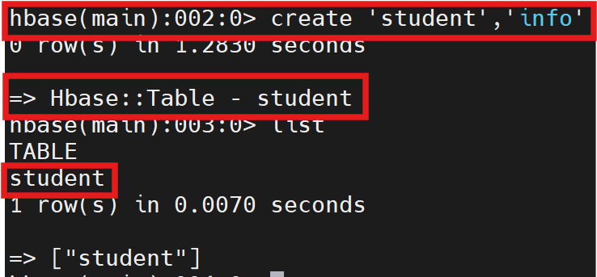
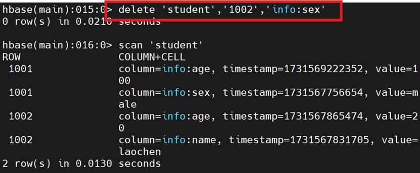

# 3.3 HBase与Spark交互操作(Python版)

HBase则是基于**列**进行数据的存储,HBase是一个高可靠性、高性能、面向列、可伸缩的分布式数据库。

这样的话,HBase就可以随着存储数据的不断增加而实时动态的增加列,从而满足Spark计算框架可以实时的将处理好的数据存储到HBase数据库中的需求。

## 3.3.1 集群启动

启动5个集群（Zookeeper分布式协调服务集群、HDFS集群、Yarn集群、Spark集群、HBase集群）

```bash
[root@hadoop01/02/03 ~]# zkServer.sh start
[root@hadoop01 ~]# start-dfs.sh
[root@hadoop01 ~]# start-yarn.sh
[root@hadoop01 ~]# start-spark-all.sh
[root@hadoop01/02/03 ~]# ntpdate -u cn.pool.ntp.org
[root@hadoop01 ~]# start-hbase.sh
```

使用`jps`命令查看进程服务，得到：主节点01:HMaster进程；从节点02:HRegionServer进程；从节点03:HRegionServer进程

## 3.3.2 进入HBase交互界面
在01主服务器启动进入HBase-shell命令行界面

```bash
hbase shell
```


进入HBase-shell交互命令界面之后，即可进行HBase数据库操作（增删改查）

## 3.3.3 HBase-shell基本操作
- `create`: 创建表
- `put`: 插入或更新数据
- `scan`: 扫描表并返回表的所有数据
- `describe`: 查看表的结构
- `get`: 获取指定行或列的数据
- `count`: 统计表中数据的行数
- `delete`: 删除指定行或者列的数据
- `deleteall`: 删除整个行或列的数据
- `truncate`: 删除整个表中的数据,但结构还在
- `drop`: 删除整个表,数据和结构都删除(慎用)

### list查询表
list命令可以查明当前HBase数据库中有哪些已经创建好的表


HBase自带数据流Table，建议保留

### create创建表
语法格式为`create 'table name','column family'`，其中table name为表名，column family为列族名。

注意：在关系型数据库MYSQL中，需要首先创建数据库，然后再创建表。但是**在HBase数据库中，不需要创建数据库，只要直接创建表就可以。**



### put操作
**插入**或者**更新**表中的数据。语法格式为`put 'table name','rowl','column family:column name','value'`

其中：table name表名，rowl行键（Row Key），column family列族名，column name列名，value列值

```bash
hbase(main)> put 'student','1001','info:sex','male'
hbase(main)> put 'student','1001','info:age','18'
hbase(main)> put 'student','1002','info:name','laochen'
hbase(main)> put 'student','1002','info:sex','female'
hbase(main)> put 'student','1002','info:age','20'
```

在例子中，student为表名，1001/1002为行标，info列族名，sex/age/name列名，female/male/18/20列值

更新 student表中行键为1001，列名info:age，键值18这一条数据中的值更新为100

```bash
hbase(main)> put 'student','1001','info:age','100'
```


### scan扫描
scan扫描student表中的所有数据


### describe查看表
describe查看表结构，语法格式为`describe 'table name'`


输出了student表的结构，表结构包含很多字段信息：
- name:表示列族名
- bloomfilter:表示为列族级别的类型
- verions:表示版本数
- in_memory:设置是否存入内存
- keep_deleted_cells:设置被删除的数据，在基于时间的历史数据查询中是否依然可见
- data_block_encoding:表示数据块的算法
- ttl:表示版本存活时间
- compression:表示设置压缩算法
- min_versions:表示最小版本数
- blockcache:表示是否设置读缓存
- replication_scope:表示设置备份

### get获取
获取指定字段的操作。语法格式为`get 'table name','row'`


### count统计
统计操作。语法格式为`count 'table name'`


### delete/deleteall删除
删除一条数据`detele`；删除所有数据`deteleall`




### truncate清空
清空操作，清空表中所有的数据。语法格式为`truncate 'table name'`


清空student表操作，**仅仅清除了其中的内容，但是student表还在**

### disable禁用 & drop删除
禁用并删除表（**如果不先禁用表，则无法删除表**）


## 3.3.4 配置jar包
由于在Spark2.0以上版本(这里采用的是spark-2.4.0版本)中,缺少将HBase数据转换为Python可读数据的.jar包文件,因此在搭建环境时,就需要将HBase的lib目录下的一些jar文件拷贝到Spark中。
这些都是编程时需要引入的jar包,需要拷贝的jar文件包括:【1】所有hbase开头的jar文件、【2】`guava-12.0.1.jar`、【3】`htrace-core-3.1.0-incubating.jar`、【4】`protobuf-java-2.5.0.jar`。

### Step 1:拷贝jar包
在主服务器hadoop01中新建目录`/export/servers/spark/jars/hbase`

```bash
cd /export/servers/spark/jars
ll -a
mkdir hbase
cd hbase
```

拷贝HBase的jar包

```bash
cp /export/servers/hbase/lib/hbase*.jar ./
cp /export/servers/hbase/lib/guava-12.0.1.jar ./
cp /export/servers/hbase/lib/htrace-core-3.1.0-incubating.jar ./
cp /export/servers/hbase/lib/protobuf-java-2.5.0.jar ./
```

### Step 2:下载python的jar包
需要注意:在Spark 2.x版本上缺少相关把hbase的数据转换python可读取的jar包,需要我们另行下载【5】`spark-examples_2.11-1.6.0-typesafe-001.jar`,将该jar包传到hadoop01中`/export/servers/spark/jars/hbase`目录;


### Step 3:配置jar包途径
在Hadoop01主服务器中，用vim编辑器打开`spark-env.sh`文件，告诉spark可以在哪个路径下找到HBase相关的jar文件

```bash
cd /export/servers/spark/conf
vi spark-env.sh
```

```bash
# spark-env.sh

```

## 3.3.5 编写Pyspark程序-读取HBase数据
### Step 1:数据准备
HBase数据表内容准备：在hadoop01主服务器中输入`hbase shell`进入HBase-shell交互命令行界面

```bash
hbase(main)> list
hbase(main)> create 'student','info'
hbase(main)> describe 'student'
hbase(main)> put 'student','1','info:name','Xueqian'
hbase(main)> put 'student','1','info:gender','F'
hbase(main)> put 'student','1','info:age','23'
hbase(main)> put 'student','2','info:name','Weiliang'
hbase(main)> put 'student','2','info:gender','M'
hbase(main)> put 'student','2','info:age','24'
```

注意：一次只能录入一个表的一行数据的一个列（也就是一个单元格）

### Step 2:编写python程序
如果要让Spark读取HBase，就需要使用`SparkContext`提供的`newAPIHadoopRDD`这个API将表的内容以RDD的形式加载到Spark中，在hadoop01的克隆终端中执行

```bash
cd /export/servers/spark/mycode/
mkdir rdd
cd ./rdd
vi SparkOperateHBase.py
```

```bash
# /export/servers/spark/mycode/rdd/SparkOperateHBase.py
# python3.7.0版读取hbase数据
from pyspark import SparkConf, SparkContext
conf = SparkConf().setMaster("local").setAppName("ReadHBase")
sc = SparkContext(conf = conf)
host='localhost'              #hbase的主机名
table='student'               #要读取的表
conf = {"hbase.zookeeper.quorum": host, "hbase.mapreduce.inputtable": table}
keyConv = "org.apache.spark.examples.pythonconverters.\
ImmutableBytesWritableToStringConverter"        #导包
valueConv = "org.apache.spark.examples.pythonconverters.HBaseResultToStringConverter"
hbase_rdd = sc.newAPIHadoopRDD("org.apache.hadoop.hbase.mapreduce.\
TableInputFormat","org.apache.hadoop.hbase.io.ImmutableBytesWritable",
"org.apache.hadoop.hbase.client.Result",keyConverter=keyConv,valueConverter=valueConv,
conf=conf)                   #新建rdd并进行配置
count=hbase_rdd.count()      #统计hbase_rdd的数据量
hbase_rdd.cache()            #将hbase_rdd的数据存储到cache里面
output=hbase_rdd.collect()   #将hbase_rdd的数据传输到output里面，变成list（即列表）
for (k,v) in output:         #以（k,v）的形式遍历output里面的元素，并输出
   print(k,v)
```

### Step 3:解释执行
在启动5个集群已经完成的前提下，进行`SparkOperateHBase.py`源代码的解释执行操作

```bash
spark-submit SparkOperateHBase.py
```


HBase中的数据表student中的数据已被spark-RDD读取、存储、输出遍历。

## 3.3.6 编写PySpark程序：向HBase表写入数据
编写应用程序把表中的两个学生信息插入到HBase的Student表中，拟添加内容如下图：

| id  | name | gender | age |
| --- | --- | --- | --- |
| 5  | Bob  |   male |  26 |
| 6  | John |   male |  28 |

### Step 1:编写程序
创建`SparkWriteHBase.py`源文件，在主服务器hadoop01克隆终端中执行

```bash
cd /export/servers/spark/mycode/rdd/
vi SparkWriteHBase.py
```

```bash
# /export/servers/spark/mycode/rdd/SparkWriteHBase.py
#python3.7.0版向hbase写入数据
from pyspark import SparkConf, SparkContext
conf = SparkConf().setMaster("local").setAppName("ReadHBase")
sc = SparkContext(conf = conf)
host = 'localhost'
table = 'student'
keyConv = "org.apache.spark.examples.pythonconverters.StringToImmutableBytesWritableConverter"
valueConv = "org.apache.spark.examples.pythonconverters.StringListToPutConverter"
conf = {"hbase.zookeeper.quorum": host,"hbase.mapred.outputtable": table,"mapreduce.outputformat.class": "org.apache.hadoop.hbase.mapreduce.TableOutputFormat","mapreduce.job.output.key.class": "org.apache.hadoop.hbase.io.ImmutableBytesWritable","mapreduce.job.output.value.class": "org.apache.hadoop.io.Writable"}
rawData = ['5,info,name,Rongcheng','5,info,gender,M','5,info,age,26','6,info,name,Guanhua','6,info,gender,M','6,info,age,27']
sc.parallelize(rawData).map(lambda x: (x[0],x.split(','))).saveAsNewAPIHadoopDataset(conf=conf,keyConverter=keyConv,valueConverter=valueConv)

```

### Step 2：解释执行
在启动5个集群已经完成的前提下，进行`SparkWriteHBase.py`源代码的解释执行操作


执行SparkWriteHBase.py源文件之后，只有日志信息显示，没有结果信息显示

### Step 3:查看结果
成功执行`SparkWriteHBase.py`源文件后，数据已经写入到HBase数据表student中了，只要在HBase-shell中查询核实即可。

在主服务器hadoop01终端中输入`hbase shell`进入HBase-shell交互式命令行界面

```bash
hbase(main)> list
hbase(main)> scan 'student'
```


可以看出新的记录已被成功插入到HBase的student表中

本章完成！！

## 3.3.6 退出系统
`exit`退出HBase-shell,退出zkServer、HDFS、Yarn、Spark、HBase共5个集群

```bash
[root@hadoop01  ~]# stop-hbase.sh                  
#在hadoop01服务器关闭HBase集群
[root@hadoop01/02/03  ~]# zkServer.sh stop         
#在3台服务器分别关闭Zookeeper集群服务
[root@hadoop01  ~]# stop-dfs.sh                    
#在hadoop01服务器关闭HDFS集群
[root@hadoop01  ~]# stop-yarn.sh                   
#在hadoop01服务器关闭YARN集群
[root@hadoop01  ~]# stop-spark-all.sh              
#在hadoop01服务器关闭Spark集群
```
