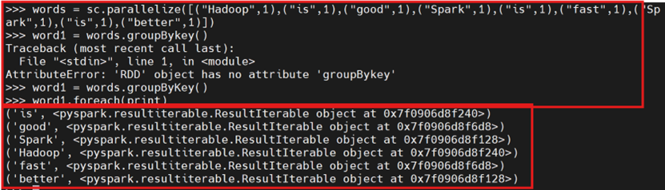

# 2.2 RDD操作（Python版）

## 2.2.0 准备工作
在主节点中先后启动Hadoop集群、Yarn集群、Spark集群

```bash
start-dfs.sh
start-yarn.sh
start-spark-all.sh
```

在主节点会话中,启动Pyspark交互式执行环境,进入python-shell

```bash
pyspark
```

## 2.2.1 转换操作（预操作）
常见的转换操作：
- filter(func):筛选出满足函数func的元素,并返回一个新的数据集。
- map(func):将每个元素传递到函数func中,并将结果返回为一个新的数据集。
- flatMap(func):与map()相似,但每个输入元素都可以映射到0或多个输出结果。
- groupByKey():应用于(K,V)键值对的数据集时,返回一个新的(K,Iterable可迭代)形式的数据集。
- reduceByKey(func):应用于(K,V)键值对的数据集时,返回一个新的(K,V)形式的数据集,其中的每个值是将每个key传递到函数func中进行聚合。

### 案例1：filter(func)
**过滤=筛选**filter(func)：筛选出满足函数func的元素，并返回一个新的数据集。

```bash
>>> lines = sc.textFile("file:///export/data/spark/mycode/python/rdd/word.txt")
>>> linesWithSpark=lines.filter(lambda line:"Spark" in line)
>>> linesWithSpark.foreach (print)
```

解析: 1.`word.txt`是在2.1中创建的文本。
      2.`lambda`为匿名函数，依次取出lines中的每一个元素，将当前取到的元素赋值给lambda表达式中的lambda的line变量，执行lambda的函数体部分


筛选出包含Spark字符串的RDD元素(即剔除了RDD元素Hadoop is good字符串)并打印输出

### 案例2：map(func)
将每个元素传递到函数func中，并将结果返回为一个新的数据集

```bash
>>> data=[1,2,3,4,5]
>>> rdd1=sc.parallelize(data)
>>> rdd2=rdd1.map(lambda x:x+10)
>>> rdd2.foreach(print)
```


从列表data中生成一个RDD(包含5个int元素),依次取出5个int元素加10, 生成一个新的RDD对象rdd2(也包含5个元素),依次输出输出。

### 案例3：map(lambda line: line.split(""))
**映射1次**，实现将每个元素传递到以指定字符(例如:空格符)隔开,并将结果返回为一个新的数据集。

```bash
>>> lines=sc.textFile( "file:///export/data/spark/mycode/python/rdd/word.txt")
>>> words=lines.map(lambda line:line.split(" "))
>>> words.foreach (print)
```


将空格隔开的字符串封装在一个列表对象中,构成RDD的一个元素,并依次输出3行字符串。

### 案例4：flatMap(lambda line:line.split(""))
**拍扁（不可再分）**,`flatMap(func)`与`map()`相似，但每个输入元素都可以映射到0或多个输出结果。

```bash
>>> lines=sc.textFile("file:///export/data/spark/mycode/python/rdd/word.txt")
>>> words=lines.flatMap(lambda line:line.split(" "))
>>> words.foreach(print)
```


对空格隔开的字符串封装在一个列表对象中,构成RDD的一个元素,并依次拍扁(元素不可再分的程度)输出。

### 案例5：groupByKey()
**分组不计数**，`groupByKey()`应用于(K,V)键值对的数据集时，返回一个新的(K,Iterable)形式的数据集。

```bash
>>> sc.parallelize([("Hadoop",1),("is",1),("good",1),("Spark",1),("is",1),("fast",1),("Spark",1),("is",1),("better",1)])
>>> words1=words.groupByKey()
>>> words1.foreach(print)
```



将所有key相同的键值对的value归并在一起。形成可迭代的Iterable对象:例如:3个(“is”,1)的键值对的key相同,则被归并在一个新的键值对(”is”,(1,1,1))中。Key是“is”,value是(1,1,1)

### 案例6：reduceByKey(func)
**分组加计数**，应用于(K,V)键值对的数据集时，返回一个新的(K,Iterable)形式的数据集，其中的每个值是将每个key传递到函数func中进行聚合后得到的结果

```bash
>>> words=sc.parallelize([("Hadoop",1),("is",1),("good",1),("Spark",1),("is",1),("fast",1),("Spark",1),("is",1),("better",1)])
>>> words1=words.reduceByKey(lambda a,b:a+b)
>>> words1.foreach(print)
```


## 2.2.2 行动操作（执行操作）
常用的RDD行动操作：
- count()：返回数据集中的元素个数
- collect()：以数组的形式返回数据集中的所有元素
- first()：返回数据集中的第一个元素
- take(n)：以数组的形式返回数据集中的前n个元素
- reduce(func)：通过函数func（输入两个参数并返回一个值）聚合数据集中的元素
- foreach(func)：将数据集中的每一个元素传递到函数func中运行

示例如下：


## 2.2.3 RDD惰性机制
惰性机制指转换过程只是记录了转换的轨迹,并不会发生真正的计算,只有遇到行动操作时,才会触发“从头到尾”的真正计算。

这里给出一段简单的代码来解释Spark的惰性机制。

### 案例1
```bash
>>> lines = sc.textFile("file:///export/data/spark/mycode/python/rdd/word.txt")
>>> lineLengths = lines.map(lambda s :len(s))
>>> totalLength = lineLengths.reduce(lambda a,b:a+b)
>>> print(totalLength)
```

第一行首先从指定文件`word.txt`中构建得到一个RDD,名称为lines,但是,由于`textFile()`方法只是一个转换操作。这行代码执行后,不会立即把`data.txt`文件加载到内存中,这时的lines只是一个指向这个文件的指针。

第二行代码用来计算每行的长度(即每行包含多少个单词),同样,由于`map()`方法只是一个转换操作,这行代码执行后,不会立即计算每行的长度。

第三行代码的`reduce()`方法是一个“动作”类型的操作,这时,就会触发真正的计算。这时,Spark会把计算分解成多个任务在不同的机器上执行,每台机器运行位于属于它自己的map和reduce,最后把结果返回给Driver Program。


### 案例2
```bash
>>> lines = sc.textFile("file:///export/data/spark/mycode/python/rdd/word.txt")
>>> lines.filter(lambda line:"Spark" in line).count()
```

上面的代码中,lines就是一个RDD。

`lines.filter()`会遍历lines中的每行文本,并对每行文本执行Lamda的表达式:line:“Spark”in line,在执行Lamda表达式时,会把当前遍历到的这行文本内容赋值给参数line,然后,执行处理逻辑”Spark”in line,也就是只有当该行文本包含“Spark”才满足条件,才会被放入到结果集中。最后,等到lines集合遍历结束后,就会得到一个结果集,这个结果集中包含了所有包含“Spark”的行。最后,对这个结果集调用count(),这是一个行动操作,会计算出结果集中的元素个数。


### 案例3
```bash
>>> lines = sc.textFile("file:///export/data/spark/mycode/python/rdd/word.txt")
>>> lines.map(lambda line : len(line.split(" "))). reduce(lambda a,b : (a > b and a or b))
```

上面代码中,lines是一个RDD,是String类型的RDD,因为这个RDD里面包含了很多行文本。

`lines.map()`是一个转换操作,之前说过`map(func)`将每个元素传递到函数func中,并将结果返回为一个新的数据集,所以`lines.map(lambda line:len(line.split(”“)))`会把每行文本都传递给Lamda表达式line:len(line.split(""))中的line,然后执行处理逻辑len(line.split(""))。

`len(line.split(""))`这个处理逻辑的功能是,对line文本内容进行单词切分,得到很多个单词构成的集合,然后,计算出这个集合中的单词的个数。

最终`lines.map(lambda line:len(line.split("")))`转换操作得到的RDD,是一个整型RDD,里面每个元素都是整数值(也就是单词的个数)。

最后,针对这个`RDD[Int]`,调用`reduce()`行动操作,完成计算。

`reduce()操作`每次接收两个参数,取出较大者留下,然后再继续比较,例如,RDD[Int]中包含了1,2,3,4,5,那么,执行reduce操作时,首先取出1和2,把a赋值为1,把b赋值为2,然后,执行大小判断,保留2。下一次,让保留下来的2赋值给a,再从RDD[Int]中取出下一个元素3,把3赋值给b,然后,对a和b执行大小判断,保留较大者3.依此类推。最终,reduce()操作会得到最大值是3。


### 案例4
找出`word.txt`文件中单行文本所包含的单词数量的最大值

```bash
>>> lines = sc.textFile("file:///export/data/spark/mycode/python/rdd/word.txt")
>>> words =lines.map(lambda line:line.split (" "))
# 从上面执行结果可以发现,lines.map()返回的结果是分割后字符串列表 List
>>> word_counts = words.map(lambda line:len(line))
>>> max_len = word_counts.reduce(lambda a,b:a if a>b else b)
>>> print(max_len)
```


## 2.2.4 RDD持久化
在Spark中,RDD采用惰性求值的机制,每次遇到行动操作,都会从头开始执行计算。

如果整个Spark程序中只有一次行动操作,这当然不会有什么问题。但是,在一些情形下,我们需要多次调用不同的行动操作,这就意味着,每次调用行动操作,都会触发一次从头开始的计算。

这对于迭代计算而言,代价是很大的,迭代计算经常需要多次重复使用同一组数据。

### 案例1：多次计算同一个RDD

```bash
>>> list = ["Hadoop","Spark","Hive"]
>>> rdd = sc.parallelize(list)
>>> print(rdd.count())
# 行动操作，触发一次真正从头到尾的计算
>>> print(','.join(rdd.collect()))		
# 行动操作，触发一次真正从头到尾的计算
```

上面代码执行过程中,前后共触发了两次从头到尾的计算。


实际上,可以通过持久化(缓存)机制避免这种重复计算的开销。可以使用`persist()`方法对一个RDD标记为持久化,之所以说“标记为持久化”,是因为出现`persist()`语句的地方,并不会马上计算生成RDD并把它持久化,而是要等到遇到第一个行动操作触发真正计算以后,才会把计算结果进行持久化,持久化后的RDD将会被保留在计算节点的内存中被后面的行动操作重复使用。

### 案例2：persist()持久化
`persist()`中包含的是持久化级别参数,比如,`persist(MEMORY_ONLY)`表示将RDD作为反序列化的对象存储于JVM中,如果内存不足,就要按照LRU原则替换缓存中的内容。

`persist(MEMORY_AND_DISK)`表示将RDD作为反序列化的对象存储在JVM中,如果内存不足,超出的分区将会被存放在硬盘上。一般而言,使用`cache()`方法时,会调用`persist(MEMORY_ONLY)`。

```bash
>>> list = ["Hadoop","Spark","Hive"]
>>> rdd = sc.parallelize(list)
>>> rdd.cache()
#会调用persist(MEMORY_ONLY),但是,语句执行到这里,并不会缓存rdd,这是因为rdd还没有被计算生成
>>> print (rdd.count())
#第一次行动操作,触发一次真正从头到尾的计算,这时才会执行上面的rdd.cache(),把这个rdd放到缓存中
>>> print(','.join(rdd.collect()))
#第二次行动操作,不需要触发从头到尾的计算,只需要重复使用上面缓存中的rdd
#最后使用unpersist()方法手动的将持久化的RDD从缓存中移除
>>> rdd. unpersist()
```


`persist(MEMORY_ONLY)`：只保存在内存

`persist(MEMORY_AND_DISK)`：先内存后磁盘

