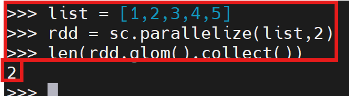
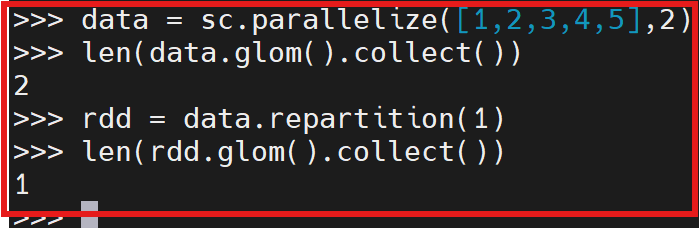
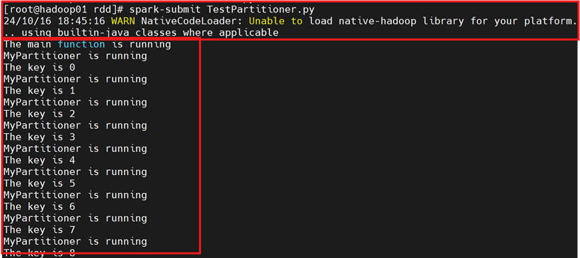
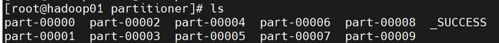
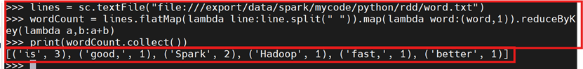

# 2.3 RDD分区
为了处理海量数据,我们应该很容易的想到让**数据并行化分布式运算**!牵扯到分布式那必然存在数据任务划分的问题!

那么RDD在创建的时候就对数据进行了有效的分区或合理的改变RDD的分区来提高运算效率!

## 2.3.0 准备工作
集群启动

```bash
start-dfs. sh
start-yarn. sh
start-spark-all.sh
```

进入`pyspark`界面

```bash
pyspark
```

## 2.3.1 手动指定分区
**方法一**：在调用`textFile()`和`parallelize()`方法的时候手动指定分区个数即可

```bash
>>> list = [1,2,3,4,5]
>>> rdd = sc.parallelize(list,2)  # 设置两个分区
>>> len(rdd.glom().collect())     # 显示分区数量
```



**方法二**：使用`repartition`（重新分区）方法重新设置分区个数
```bash
>>> data = sc.parallelize([1,2,3,4,5],2)
>>> len(data.glom().collect())	
>>> rdd = data.repartition(1)        # 对data这个RDD进行重新分区
>>> len(rdd.glom().collect())		     # 显示rdd这个rdd的分区数量
```



## 2.3.2 自定义分区
Spark提供了自带的`HashPartitioner`（哈希分区）和`RangePartitioner`（区域分区），能满足大多数应用场景的需求。

与此同时，Spark也支持**自定义分区方式**，即通过提供一个自定义的分区函数来控制RDD的分区方式，从而利用领域知识进一步减少通信开销。

### 案例1
根据key值的最后一位数字，写入到不同的文件，例如：

```bash
10 写入到part-00000
11 写入到part-00001
12 写入到part-00002
...................
19 写入到part-00009
```

在01主服务器终端，进入`/export/data/spark/mycode/rdd`目录，新建并编辑文件

```bash
from pyspark import SparkConf,SparkContext

def MyPartitioner(key):
	print("MyPartitioner is running")
	print('The key is %d' % key)
	return key%10

def main():
	print("The main function is running")
	conf = SparkConf().setMaster("local").setAppName("MyApp")
	sc = SparkContext(conf = conf)
	data = sc.parallelize(range(10),5)
	data.map(lambda x:(x,1)).partitionBy(10,MyPartitioner).map(lambda x:x[0]).saveAsTextFile("file:///export/data/spark/mycode/python/rdd//partitioner")

if __name__ == '__main__':
	main()
```

在01主服务器终端中，解释执行`TestPartitioner.py`源文件

```bash
cd /export/data/spark/mycode/rdd/
spark-submit TestPartitioner.py
```



成功解释执行TestPartitioner.py源文件,生成了10个结果文件



### 案例2：词频统计
在主服务器01中，`pyspark`进入pyspark-shell命令行界面

```bash
# word.txt内容如下，在2.1中创建
Hadoop is good,
Spark is fast,
Spark is better
```

```bash
>>> lines = sc.textFile("file:///export/data/spark/mycode/python/rdd/word.txt")
>>> wordCount = lines.flatMap(lambda line:line.split(" ")).map(lambda word:(word,1)).reduceByKey(lambda a,b:a+b)
>>> print(wordCount.collect())
```


