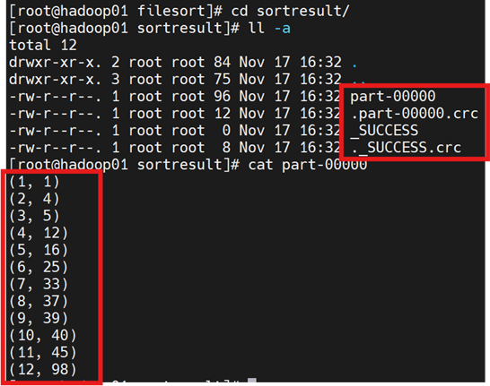

# 2.6 RDD综合编程(Python版)

## 2.6.1 集群启动
在3台服务器分别启动Zookeeper集群服务器

```bash
zkServer.sh start
```

在hadoop01主服务器上启动集群

```bash
start-dfs.sh
start-yarn.sh
start-spark-all.sh
```

## 2.6.2 案例1、求TOP值
在hadoop01主服务器`export/servers/spark/mycode/rdd`目录下新建文本文件`file0.txt`，要求求出Top N个payment值，在hadoop01主服务器中执行

### Step 1:数据准备
每一行都4个字段（Orderid字段，userid字段，payment字段，productid字段）的值构成，不同字段值之间用逗号隔开。

```bash
# file0.txt
1,1768,50,155 
2,1218,600,211 
3,2239,788,242 
4,3101,28,599 
5,4899,290,129 
6,3110,54,1201
7,4436,259,877 
8,2369,7890,27
```

### Step 2:编写源程序TopN.py
在hadoop01主服务器`/export/servers/spark/mycode/rdd`目录下创建源程序`TopN.py`

```bash
# /export/servers/spark/mycode/rdd/TopN.py
from pyspark import SparkConf, SparkContext
conf = SparkConf().setMaster("local").setAppName("ReadHBase")
sc = SparkContext(conf = conf)
lines = sc.textFile("file:///export/servers/spark/mycode/rdd/file0.txt")   
#file0.txt文件所在绝对目录
result1 = lines.filter(lambda line:(len(line.strip()) > 0) and (len(line.split(","))== 4))
result2 = result1.map(lambda x:x.split(",")[2])
result3 = result2.map(lambda x:(int(x),""))
result4 = result3.repartition(1)
result5 = result4.sortByKey(False)
result6 = result5.map(lambda x:x[0])
result7 = result6.take(5)
for a in result7:
	print(a)
```

代码解析：
1. lines=……：从文件中读取数据生产RDD
2. result1=……：过滤，规范RDD
3. result2=……：切割，取出并保存列表的第3个元素（payment字段）
4. result3=……：转换操作，把result2中的每个元素从字符串类型转换成整型
5. result4=……：调用repartition实现重分区，所有元素都在一个分区内
6. result5=……：实现对result4中的所有元素都按照key值的降序排列
7. result6=……：把每个元素的key值取出来（即payment值）
8. result7=……：for循环依次取出5个payment字段的值并打印，也就是payment字段的前5个最大值

### Step 3:解释执行
在hadoop01主服务器中解释执行`TopN.py`


## 2.6.3 案例2、文件排序
在hadoop01主服务器`/export/servers/spark/mycode/rdd/filesort`目录下有3个文本文件`filel.txt`、`file2.txt`、`file3.txt`,每个文件中的每一行内容均为一个整数。

要求读取3个文本文件中的整数,进行排序,并将排序结果输出到一个新的文件目录`/export/servers/spark/mycode/rdd/filesort/sortresult`中,输出的内容个数为每行两个整数:第一个整数为第二个整数的排序位次,第二个整数为文件中的数据。

### Step 1:数据准备
在hadoop01主服务器中创建`filesort`文件夹，在`/export/servers/spark/mycode/rdd/filesort`目录下创建3个文本文件`filel.txt`、`file2.txt`、`file3.txt`

```bash
# file1.txt
33
37
12
40
```

```bash
# file2.txt
4
16
39
5
```

```bash
# file3.txt
1
45
25
98
```

### Step 2:编写源程序FileSort.py
在hadoop01主服务器中`/export/servers/spark/mycode/rdd`目录下新建源程序`FileSort.py`

```bash
# /export/servers/spark/mycode/rdd/FileSort.py
from pyspark import SparkConf,SparkContext
index=0
def getindex():
   global index
   index+=1
   return index
def main():
   conf = SparkConf().setMaster("local[1]").setAppName("FileSort")
   sc = SparkContext(conf = conf)
   lines= sc.textFile("file:///export/servers/spark/mycode/rdd/filesort/file*.txt")
   index = 0
   result1 = lines.filter(lambda line:(len(line.strip()) > 0))
   result2=result1.map(lambda x:(int(x.strip()),""))
   result3=result2.repartition(1)
   result4=result3.sortByKey(True)
   result5=result4.map(lambda x:x[0])
   result6=result5.map(lambda x:(getindex(),x))
   result6.foreach(print)
   result6.saveAsTextFile("file:///export/servers/spark/mycode/rdd/filesort/sortresult")
if __name__ == '__main__':
	main()
```

代码解析：
1. result1=……：过滤掉空行，得到一个新的RDD
2. result2=……：将字符串元素取出，去掉尾部空格符、转换为整型RDD键值对
3. result3=……：合并分区
4. result4=……：升序排序
5. result5=……：取key值
6. result6=result5.map…：取元素键值，再排位次序，构成元组
7. saveAsTextFile：保存到指定目录文件中

### Step 3:解释执行
解释执行源文件FileSort.py


### Step 4:执行结果
系统会自动在`/export/servers/spark/mycode/rdd/filesort/`目录中生成一个`sortresult`文件夹



## 2.6.4 案例3、二次排序
在目录`export/servers/spark/mycode/rdd`下新建文本文件`file4.txt`,请对数据进行排序。

首先根据第1列数据降序排序,如果第1列数据相等,则根据第2列数据降序排序。

### Step 1:数据准备
在hadoop01主服务器的目录`export/servers/spark/mycode/rdd`下新建文本文件`file4.txt`

```bash
file4.txt
5 3
1 6
4 9
8 3
4 7
5 6
3 2
```

### Step 2:编写程序SecondarySortKey.py
在hadoop01主服务器中的`/export/servers/spark/mycode/rdd`目录中创建`SecondarySortKey.py`

```bash
# /export/servers/spark/mycode/rdd/SecondarySortKey.py
from operator import gt     #如果要在pycharm中执行，则需要先导入该包gt：file—setting
from pyspark import SparkContext, SparkConf
class SecondarySortKey():
   def __init__(self, k):
      self.column1 = k[0]
      self.column2 = k[1]
   def __gt__(self, other): 
      if other.column1 == self.column1:
         return gt(self.column2,other.column2)
      else:
         return gt(self.column1, other.column1)
def main():
   conf = SparkConf().setAppName('spark_sort').setMaster('local[1]')
   sc = SparkContext(conf=conf)
   file="file:///export/servers/spark/mycode/rdd/file4.txt"
   rdd1 = sc.textFile(file)
   rdd2=rdd1.filter(lambda x:(len(x.strip()) > 0))
   rdd3=rdd2.map(lambda x:((int(x.split(" ")[0]),int(x.split(" ")[1])),x))
   rdd4=rdd3.map(lambda x: (SecondarySortKey(x[0]),x[1]))
   rdd5=rdd4.sortByKey(False)
   rdd6=rdd5.map(lambda x:x[1])
   rdd6.foreach(print)
if __name__ == '__main__':
   main()
```

`rdd2 = rdd1.filter(lambda x:(len(x.strip())>0))`:过滤空行，只保留有数据的行

### Step 3:解释执行


本章完！

