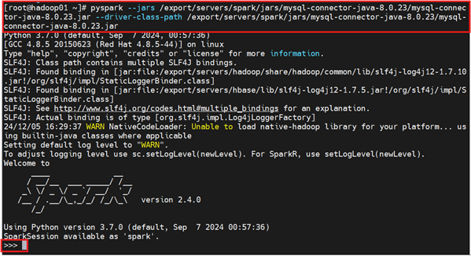

# 5.2 使用Pyspark读写Mysql数据库(Python版)
MySQL是一个关系型数据库管理系统。MySQL最流行的关系型数据库管理系统,在WEB应用方面MySQL是最好的RDBMS(关系数据库管理系统)应用软件之一。

Pyspark SQL 可以支持Parquet、JSON、Hive等数据源,并通过JDBC连接外部数据源,本实验5.2实现的就是Pyspark SQL通过JDBC连接外部数据源Mysql数据库。

JDBC(Java DataBase Connectivity: Java数据库连接)是一种用于执行SQL语句的Java API,可以为多种关系数据库（Mysql、Oracle、Hive、MongoDB、Redis等）提供统一访问,它由一组用Java语言编写的类和接口组成。

## 5.2.1 在MySQL中创建数据源（数据库+数据表）

在hadoop01终端中，启动mysql服务器、启动mysql客户端

```bash
[root@hadoop01 ~]# service mysqld start
[root@hadoop01 ~]# mysql -u root -p
```

添加数据

```bash
mysql> show databases;
mysql> create database spark;
mysql> use spark;
mysql> create table student(id int(4),name char(20),gender char(4),age int(4));
mysql> alter table student change id id int auto_increment primary key;
mysql> insert into student values(1,'Joey','M',35);
mysql> insert into student values(2,'Anne','F',28);
mysql> select * from student;
```

退出Mysql-shell客户端，但是不要关闭Mysql服务器

```bash
mysql> exit;
Bye
```

## 5.2.2 编写PySpark应用程序连接MySQL数据库并且读写数据
PySpark支持通过JDBC方式连接到其他数据库获取数据生成DataFrame

在windows系统环境下载MySQL的JDBC驱动程序[mysql-connector-java-8.0.23.tar.gz](Spark/packages/mysql-connector-java-8.0.23.tar.gz)

上传至hadoop01服务器的`/export/software`目录下


将压缩包解压到Spark安装路径的子目录`/export/servers/spark/jars`中

```bash
[root@hadoop01 software]# tar -zxvf mysql-connector-java-8.0.23.tar.gz -C /export/servers/spark/jars/
[root@hadoop01 software]# cd /export/servers/spark/jars/
[root@hadoop01 jars]# ls
[root@hadoop01 jars]# cd mysql-connector-java-8.0.23/
[root@hadoop01 mysql-connector-java-8.0.23]# ls
```


启动4个集群（Zookeeper分布式协调服务集群、HDFS集群、Yarn集群、Spark集群）

```bash
[root@hadoop01/02/03 ~]# zkServer.sh start
[root@hadoop01 ~]# start-dfs.sh
[root@hadoop01 ~]# start-yarn.sh
[root@hadoop01 ~]# start-spark-all.sh
[root@hadoop01/02/03 ~]# ntpdate -u cn.pool.ntp.org
# #在3台服务器各执行1次、保持3台服务器时间同步
```

启动pyspark-shell
克隆打开一个hadoop01会话，在克隆终端中执行带参数启动Pyspark

```bash
[root@hadoop01 ~]# pyspark --jars /export/servers/spark/jars/mysql-connector-java-8.0.23/mysql-connector-java-8.0.23.jar --driver-class-path /export/servers/spark/jars/mysql-connector-java-8.0.23/mysql-connector-java-8.0.23.jar
```



如上图便成功启动了基于Yarn模式的Spark集群，成功进入Python-shell命令行界面

注意：
- Hadoop01终端启动MySQL服务器
- Hadoop01克隆终端中执行Pyspark-shell命令

## 5.2.3 案例操作
### 案例1、Pyspark-shell读取Mysql数据库中的数据
在hadoop01克隆终端中执行

```bash
>>> jdbcDF = spark.read.format("jdbc").option("url", "jdbc:mysql://localhost:3306/spark").option("driver","com.mysql.jdbc.Driver").option("dbtable", "student").option("user", "root").option("password", " ").load()
>>> jdbcDF.show()
```

spark是数据库名、student是数据表名


### 案例2、Pyspark-shell向Mysql数据库写入数据
为了看到MYSQL数据库在spark程序执行前后发生的变化，先回到hadoop01终端，使用命令查看MySQL数据库中的数据库spark中的表student的内容

```bash
[root@hadoop01 ~]# mysql -u root -p
mysql> use spark;
mysql> select * from student;
```


再向Mysql数据库的spark中的student表中再添加插入2条记录，在克隆终端hadoop01的pyspark-shell中编写程序

```bash
>>> from pyspark.sql.types import Row
>>> from pyspark.sql.types import StructType
>>> from pyspark.sql.types import StructField
>>> from pyspark.sql.types import StringType
>>> from pyspark.sql.types import IntegerType
>>> studentRDD = spark.sparkContext.parallelize(["3 zhangsan M 15","4 lisi M 27"]).map(lambda line : line.split(" "))
>>> schema = StructType([StructField("name", StringType(), True),StructField("gender", StringType(), True),StructField("age",IntegerType(), True)])
>>> rowRDD = studentRDD.map(lambda p : Row(p[1].strip(), p[2].strip(),int(p[3])))
>>> studentDF = spark.createDataFrame(rowRDD, schema)
>>> prop = {}
>>> prop['user'] = 'root'
>>> prop['password'] = ' '
>>> prop['driver'] = "com.mysql.jdbc.Driver"
>>> studentDF.write.jdbc("jdbc:mysql://localhost:3306/spark",'student','append', prop)
```

代码解析：
1. 导入必要的 PySpark SQL 类型：
- Row：用于创建行数据。
- StructType：用于定义一个结构化数据类型，即一个包含多个字段的复合数据类型。
- StructField：用于定义一个结构化字段。
- StringType：字符串类型的字段。
- IntegerType：整数类型的字段。
2. 创建一个名为 studentRDD 的 RDD（弹性分布式数据集），它包含两行数据。（每行数据用空格分隔的属性组成）
3. 定义一个 schema，这是一个 StructType 对象，它定义了数据框架（DataFrame）的列和它们的数据类型。在这个例子中，有三个字段：name（字符串类型），gender（字符串类型），age（整数类型）。
4. 将 studentRDD 中的数据转换为 Row 对象的 RDD，这里使用 map 函数来处理每一行数据，将字符串分割后的数组转换为 Row 对象。
5. 使用 spark.createDataFrame 方法将 rowRDD 和之前定义的 schema 转换成一个 DataFrame，命名为 studentDF。
6. 定义一个 prop 字典，用于存储连接 MySQL 数据库所需的属性
7. 使用 studentDF.write.jdbc 方法将 DataFrame studentDF 写入 MySQL 数据库。这里的参数包括：
- JDBC URL（"jdbc:mysql://localhost:3306/spark"）：数据库的连接字符串。
- 表名（'student'）：要写入的数据库表。
- 'append'：写入模式，这里表示将数据追加到表中。
- prop：包含数据库连接属性的字典。

执行完后，切换到hadoop01中查询Mysql数据库中最新的内容

```bash
mysql> select * from student;
```


本章完！

退出MySQL-shell（在Hadoop01服务器中执行）

```bash
mysql> exit;
```

退出Pyspark-shell（在克隆终端hadoop01客户端中执行）

```bash
>>> exit()
```

关闭Mysql服务器（在Hadoop01服务器中执行）

```bash
[root@hadoop01 ~]# service mysqld stop
```

退出集群

```bash
[root@hadoop01/02/03  ~]# zkServer.sh stop
[root@hadoop01  ~]# stop-dfs.sh 
[root@hadoop01  ~]# stop-yarn.sh
[root@hadoop01  ~]# stop-spark-all.sh
```
