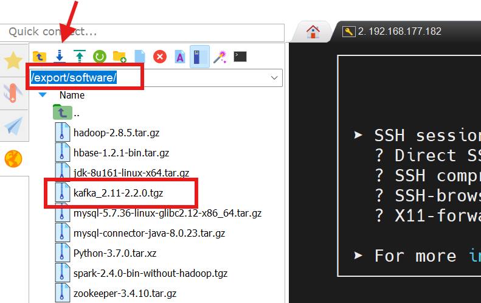
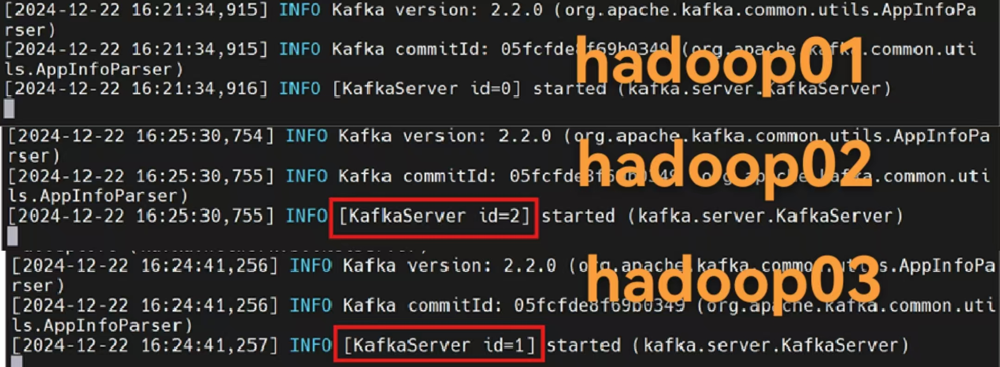
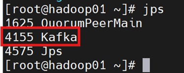
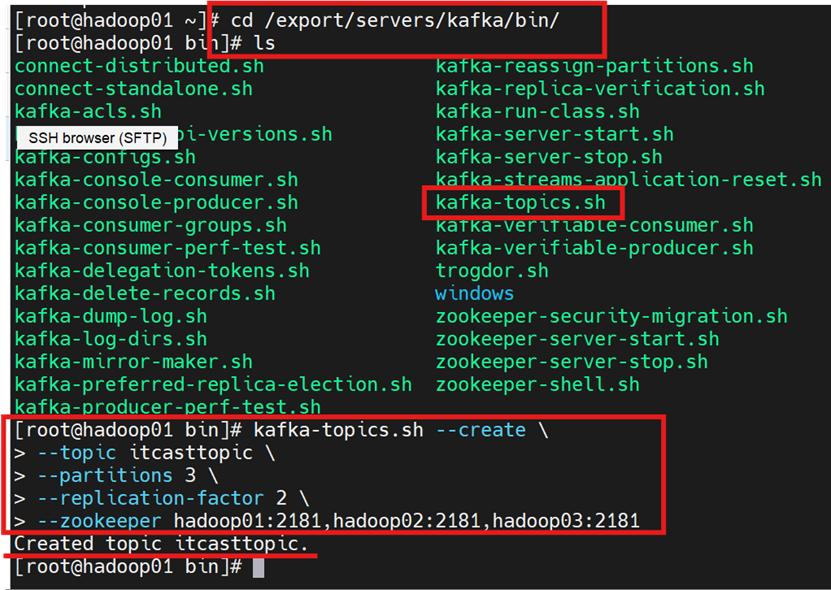
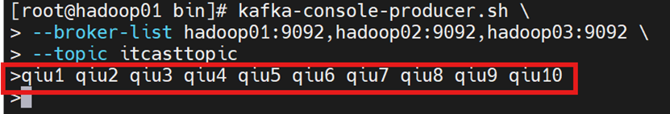
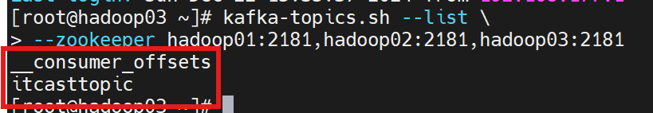

# 6.1 Kafka安装与测试 (Python版)

## 6.1.1 Kafka简介
### Kafka
Kafka是一种高吞吐量的分布式发布订阅消息系统,用户通过Kafka系统可以发布大量的消息,同时也能实时订阅消费消息。

Kafka可以同时满足在线实时处理和批量离线处理。

在公司的大数据生态系统中,可以把Kafka作为数据交换枢纽,不同类型的分布式系统(关系数据库、NoSQL数据库、流处理系统、批处理系统等),可以统一接入到Kafka,实现和Hadoop各个组件之间的不同类型数据的实时高效交换。

在Spark生态体系中,Kafka占有非常重要的位置。Kafka是一个使用Scala语言编写的基于ZooKeeper的高吞吐量低延迟的分布式发布与订阅消息系统,它可以实时处理大量消息数据以满足各种需求。

在实际开发中,Kafka常常作为Spark Streaming的实时数据源,Spark Streaming从Kafka中读取实时消息进行处理,保证了数据的可靠性与实时性。

一个典型的Kafka集群中包含若干**生产者Producer**(数据可以是Web前端产生的页面内容或者服务器日志等)、若干**Broker**、若干**消费者Cosumer**(可以是Hadoop集群、实时监控程序、数据仓库或其他服务)以及一个ZooKeeper集群。

ZooKeeper用于管理和协调Broker。当Kafka系统中新增了Broker(代理服务器)或者某个Broker故障失效时,ZooKeeper将通知生产者和消费者。生产者和消费者据此开始与其他Broker协调工作。

Kafka通过**主题**对**消息**进行分类,一个主题可以分为多个分区,且每个分区可以存储于不同的Broker上,也就是说,一个主题可以横跨多个服务器。

### Kafka工作机制（消息队列机制）
1. Broker: Kafka集群包含一个或多个服务器,这种服务器被称为broker (代理服务器)
2. Topic:topic是kafka中消息的分类单位，每个主题表示一类消息。 (物理上不同Topic的消息分开存储,逻辑上一个Topic的消息虽然保存于一个或多个broker上,但用户只需指定消息的Topic即可生产或消费数据而不必关心数据存于何处)
3. Partition:Partition是物理上的概念,kafka对主题进行水平划分的机制，每个Topic包含一个或多个Partition.
4. Producer:生产者Producer负责发布消息到Kafka broker
5. Consumer: 消费者Consumer向Kafka broker读取消息的客户端。
6. Consumer Group:用户组，每个Consumer属于一个特定的Consumer Group(可为每个Consumer指定 group name,若不指定group name则属于默认的group)，每个消费者组中的消费者会自动协调分区消费。

## 6.1.2 Kafaka安装、集群部署
访问Kafka官网https://kafka.apache.org/downloads下载Kafka稳定版本.

注意Kafka版本一定要选择和自己电脑上已经安装的scala版本号一致才可以！

本教程安装的Spark版本号是2.4.0(内置scala版本号是2.11),所以,一定要选择Kafka版本号是2.11开头的。

Scala版本号(Spark2.4.0自带的scala内置版本2.11),后面的2.2.0是Kafka自身的版本号;



进行解压和重命名

```bash
[root@hadoop01 ~]# cd /export/software/
[root@hadoop01 software]# tar -zxf kafka_2.11-2.2.0.tgz -C /export/servers/
[root@hadoop01 software]# cd /export/servers/
[root@hadoop01 servers]# ls
[root@hadoop01 servers]# mv kafka_2.11-2.2.0 kafka
[root@hadoop01 servers]# ls
```

让root获取kafaka目录管理员权限

```bash
[root@hadoop01 servers]# chown -R root ./kafka
```

## 6.1.3 Kafaka集群部署
修改kafka配置文件

### Step 1:server.properties
在hadoop01终端进入kafka文件夹下的config目录，修改`server.properties`配置文件

```bash
# server.properties
############################# Server Basics #############################
# The id of the broker. This must be set to a unique integer for each broker.# broker的全局唯一编号，不能重复
broker.id=0
#hadoop01->0    hadoop02->1    hadoop03->2 
#用来监听链接的端口，producer或consumer将在此端口建立连接
port=9092
############################# Socket Server Settings #############################
#处理网络请求的线程数量
num.network.threads=3
#用来处理磁盘I/O的现成数量
num.io.threads=8
#发送套接字的缓冲区大小
socket.send.buffer.bytes=102400
#接受套接字的缓冲区大小
socket.receive.buffer.bytes=102400
#请求套接字的缓冲区大小
socket.request.max.bytes=104857600
############################# Log Basics #############################
#kafka运行日志存放的路径
log.dirs=/export/data/kafka/
#topic在当前broker上的分片数
num.partitions=2
#用来恢复和清理data下数据的线程数量
num.recovery.threads.per.data.dir=1
############################ Log Retention Policy ############################
#segment文件保留的最长时间，超时将被删除
log.retention.hours=1
#滚动生成新的segment文件的最大时间
log.roll.hours=1
#日志文件中每个segment的大小，默认为1GB
log.segment.bytes=1073741824
#周期性检查文件大小的时间
log.retention.check.interval.ms=300000
#日志清理是否打开
log.cleaner.enable=true
############################# Zookeeper #############################
#broker需要使用zookeeper保存meta数量
zookeeper.connect=hadoop01:2181,hadoop02:2181,hadoop03:2181
#zookeeper链接超时时间
zookeeper.connection.timeout.ms=6000
#partition buffer中，消息的条数达到阈值时，将触发flush到磁盘的操作
log.flush.interval.messages=10000
#消息缓冲的时间，达到阈值时，将触发flush到磁盘的操作
log.flush.interval.ms=3000
#删除topic
delete.topic.enable=true
#设置本机IP
host.name=hadoop01
#hadoop01/02/03终端中该参数值分别设置为hadoop01/02/03
```

### Step 2：添加环境变量
在hadoop01终端中进入`/etc/profile`环境变量配置文件，添加Kafaka环境变量

```bash
# 
# ************************Kafka*******************************
export KAFKA_HOME=/export/servers/kafka
export PATH=$PATH:$KAFKA_HOME/bin
```

修改后执行生效命令

```bash
source /etc/profile
```

### Step 3:分发文件
修改hadoop01终端中的`/etc/profile`环境变量配置文件之后，还需将Hadoop01中的`/export/server/kafka`目录（含其中的目录），以及`/etc/profile`配置文件分发到hadoop02和hadoop03终端

```bash
[root@hadoop01 ~]# cd /export/servers/
[root@hadoop01 servers]# scp -r kafka/ hadoop02:/export/servers/
[root@hadoop01 servers]# scp -r kafka/ hadoop03:/export/servers/
[root@hadoop02 ~]# cd /export/servers/
[root@hadoop02 servers]# ls
[root@hadoop03 ~]# cd /export/servers/
[root@hadoop03 servers]# ls
[root@hadoop01 servers]# scp /etc/profile hadoop02:/etc/profile
[root@hadoop01 servers]# scp /etc/profile hadoop03:/etc/profile
```

**分别**切换到hadoop02和hadoop03终端命令行界面，分别对`/export/servers/kafka/config`目录下的配置文件`server.properties`文件中的`broker.id`参数和`host.name`参数按注释内容进行修改

## 6.1.4 Kafka集群启动与测试
启动Zookeeper集群服务，Kafka服务启动之前，需要先启动Zookeeper集群服务，分别在3个终端hadoop01、hadoop02、hadoop03中分别执行命令启动Zookeeper服务

```bash
[root@hadoop01/02/03 ~]# zkServer.sh start
```

分别在hadoop01、hadoop02、hadoop03终端启动kafka集群服务

```bash
[root@hadoop01/02/03 ~]# cd /export/servers/kafka/
[root@hadoop01/02/03 kafka]# bin/kafka-server-start.sh config/server.properties
```

这种方式启动之后，所在的hadoop01终端不可关闭

Kafka启动的另一个方式：`bin/kafka-server-start.sh config/server.properties &`（这种方式启动之后，所在的hadoop01终端可以关闭）

**注意**：启动命令都要在kafka目录下执行命令



启动Kafka集群服务后,控制台输出的消息中无异常信息,并且光标光标始终处于闪烁状态,即表示Kafka集群服务启动成功!(注意上图中左下角的光标状态:正常为闪烁状态!)

**注意**:当前的hadoop01/02/03终端采用方式1成功启动了Kafka集群服务(后台服务区功能),Linux-shell命令行中的光标处于闪烁状态,务必不要关闭hadoop01/02/03终端中的任何1个,(一旦关闭,Kafka集群服务就会停止)。

克隆一个hadoop01终端会话（记为：数据源终端）,在其中使用`jps`命令查看kafka进程是否正常（测试）



## 6.1.5 Kafka生产者与消费者实例测试
基于命令行方式使用Kafka

若希望生产者(Producer)与消费者(Consumer)实现通信,就必须先创建1个主题(Topic),主题也可称为“公共频道”

在Kafka解压包中的/bin目录下,有一个`kafka-topic.sh`文件,通过该文件就可以操作与主题组件相关的功能,由于之前已配置了环境变量,因此可在任意目录下访问bin目录下的所有文件。

```bash
[root@hadoop01 ~]# cd /export/servers/kafka/bin/
[root@hadoop01 bin]# ls
```

查询有没有kafka-topics.sh文件存在

### Step 1:创建主题
在克隆终端hadoop01(1)中,创建名为“itcasttopic”的主题Topic;

```bash
[root@hadoop01 ~]# cd /export/servers/kafka/bin/
[root@hadoop01 bin]# kafka-topics.sh --create \
> --topic itcasttopic \
> --partitions 3 \
> --replication-factor 2 \
> --zookeeper hadoop01:2181,hadoop02:2181,hadoop03:2181
```

创建了1个名为itcasttopic的主题,该主题的分区数为3,副本数为2



### Step 2:创建生产者
在hadoop01克隆终端中创建主题Topic之后,就可以创建生产者(Producer)生产消息,用来模拟实际生产环境中的流数据(不间断消息)。

在Kafka的解压安装包目录bin中存在一个`Kafka-console-producer`组件文件,可模拟实现生产者功能(例如:向主题(Topic)中发送消息数据);

在克隆终端hadoop01(1)执行如下命令，实现Producer生产者功能

```bash
[root@hadoop01 bin]# kafka-console-producer.sh \
> --broker-list hadoop01:9092,hadoop02:9092,hadoop03:9092 \
> --topic itcasttopic
```

执行kafka生产者命令之后，无消息输出，光标停留在等待输入状态，留着！不要关闭删除

### Step 3:创建消费者
克隆一个hadoop02终端，在hadoop02克隆端创建消费者端。目的是显示生产者端【hadoop01克隆端】输入的消息。

在Kafka的解压安装包目录bin中存在一个`Kafka-console-consumer.sh`组件文件,可实现消费者模拟功能(例如:接收并显示主题(Topic)中发送过来的消息数据)

```bash
[root@hadoop02 ~]# cd /export/servers/kafka/bin/
[root@hadoop02 bin]# kafka-console-consumer.sh \
> --from-beginning --topic itcasttopic --bootstrap-server \
> hadoop01:9092,hadoop02:9092,hadoop03:9092
```

左下角光标闪烁，等待接收并显示主题从生产者端【hadoop01克隆端】生产者发送的消息，而在消费者端【hadoop02克隆端】没有接收到任何消息/信息是因为生产者端并没有输入并发送消息/信息到kafka集群服务器，自然在消费者端中没有内容可显示。

### Step 4:对话
切换到生产者端【hadoop01克隆端】，输入一些消息/信息。Enter回车即可发送给主题topic



切换到消费者端【hadoop02克隆端】，查看消息/信息



kafka主题查看：克隆一个hadoop03的会话，查看kafka主题
```bash
[root@hadoop03 ~]# kafka-topics.sh --list \
> --zookeeper hadoop01:2181,hadoop02:2181,hadoop03:2181
```


kafka主题删除：在一个hadoop03的克隆端中测试

```bash
[root@hadoop03 ~]# kafka-topics.sh --delete \
> --zookeeper hadoop01:2181,hadoop02:2181,hadoop03:2181
> --topic 主题名
```

## 6.1.6 Kafka集群退出
分别关闭3个克隆的端口hadoop01(1)、hadoop02(1)、hadoop03(1),直接关闭`Ctrl+C`即可

在Kafka集群hadoop01、hadoop02、hadoop03中,分别`Ctrl+C`关闭Kafka集群角色服务;

关闭Zookeeper集群服务;分别在3个终端hadoop01、hadoop02、hadoop03中**分别**执行关闭Zookeeper服务的命令。

```bash
[root@hadoop01/02/03 ~]# zkServer.sh stop
```

本章完！
