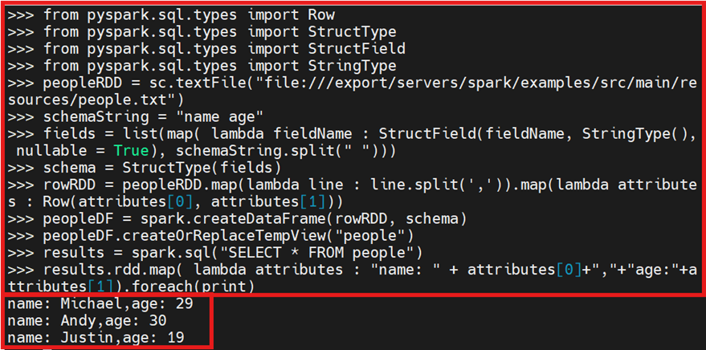

# 4.2 RDD转换为DataFrame(Python版)
Spark官网提供了两种方法来实现从RDD(弹性分布式数据集)转换得到DataFrame(数据帧)。

方法1:利用反射来推断包含特定类型对象的RDD的schema(模式),适用对已知数据结构的RDD转换;

方法2:使用编程接口,构造一个schema(架构)并将其应用在已知的RDD上。

## 4.2.1 集群启动
启动4个集群(Zookeeper分布式协调服务集群、HDFS集群、Yarn集群、Spark集群)

```bash
# 在3台服务器分别启动Zookeeper集群服务器
zkServer.sh start
# 在hadoop01中开启3个集群
start-dfs.sh
start-yarn.sh
start-spark-all.sh
```

## 4.2.2 利用反射机制推断RDD模式（方法1）

### Step 1:数据准备
`/export/servers/spark/examples/src/main/resources/`目录下找到两个样例数据`people.json`和`people.txt`

现在要把`people.txt`加载到内存中生成一个DataFrame（数据帧），并查询其中的数据

（查询流程：加载数据——>注册视图——>查询数据——>保存数据）

### Step 2:toDF()
在利用反射机制推断RDD模式时，使用`toDF()`方法

`RDD.toDF()`：将RDD转换为DataFrame。toDF()方法会将RDD中的每个元素转换为一个行对象，然后将这些行对象组成一个DataFrame。每行对象包含了RDD元素中的各个字段，可以通过列名进行访问。

在hadoop01中启动`pyspark`，进入spark集群模式下的python-shell交互式环境

```bash
>>> from pyspark.sql import Row
>>> peopleDF = sc.textFile("file:///export/servers/spark/examples/src/main/resources/people.txt").map(lambda line:line.split(",")).map(lambda x:Row(*(x))).toDF()
>>> peopleDF.createOrReplaceTempView("people")
>>> personsDF = spark.sql("select * from people")
>>> personsDF.rdd.map(lambda t:"Name:"+t[0]+","+"Age:"+t[1]).foreach(print)
```


`peopleDF.createOrReplaceTempView("people")`注册为临时表，这样才能供sql查询使用

## 4.2.3 利用反射机制推断RDD模式（方法2）
在hadoop01中启动`pyspark`，进入spark集群模式下的python-shell交互式环境

```bash
>>> from pyspark.sql import Row
>>> people = spark.sparkContext.textFile("file:///export/servers/spark/examples/src/main/resources/people.txt").map(lambda line:line.split(",")).map(lambda p:Row(name=p[0],age=int(p[1])))
>>> schemaPeople = spark.createDataFrame(people)
>>> schemaPeople.createOrReplaceTempView("people")
>>> personsDF = spark.sql("select name,age from people where age > 20")
>>> personsRDD = personsDF.rdd.map(lambda p:"Name:"+p.name+","+"Age:"+str(p.age))
>>> personsRDD.foreach(print)
```


`schemaPeople = spark.createDataFrame(people)`DataFrame数据抽象能够进行SQL数据操作

`schemaPeople.createOrReplaceTempView("people")`注册临时表供SQL查询使用

## 4.2.4 使用编程方式定义RDD模式（方法1）
当无法提前获知数据结构时，就需要采用编程方式定义RDD模式。（“表头”+“表中的记录”）

在hadoop01中启动`pyspark`，进入spark集群模式下的python-shell交互式环境

```bash
>>> from pyspark.sql.types import *                              
>>> from pyspark.sql import Row
# 生成“表头”                            
>>> schemaString = "name age"                                     
>>> fields = [StructField(field_name,StringType(),True) for field_name in schemaString.split(" ")]
>>> schema = StructType(fields)  
# 生成“表中的记录”                                 
>>> lines = spark.sparkContext.textFile("file:///export/servers/spark/examples/src/main/resources/people.txt")
>>> parts = lines.map(lambda x:x.split(","))                      
>>> people = parts.map(lambda p:Row(p[0],p[1].strip()))
>>> schemaPeople = spark.createDataFrame(people,schema)
>>> schemaPeople.createOrReplaceTempView("people")
>>> results = spark.sql("SELECT name,age FROM people")
>>> results.show()
```


`schemaPeople = spark.createDataFrame(people,schema)`把"表头"+"表中记录"拼接在一起

## 4.2.5 使用编程方式定义RDD模式（方法2）
在hadoop01中启动`pyspark`，进入spark集群模式下的python-shell交互式环境

```bash
>>> from pyspark.sql.types import Row
>>> from pyspark.sql.types import StructType
>>> from pyspark.sql.types import StructField
>>> from pyspark.sql.types import StringType
>>> peopleRDD = sc.textFile("file:///export/servers/spark/examples/src/main/resources/people.txt")
>>> schemaString = "name age"
>>> fields = list(map( lambda fieldName : StructField(fieldName, StringType(), nullable = True), schemaString.split(" ")))
>>> schema = StructType(fields)
>>> rowRDD = peopleRDD.map(lambda line : line.split(',')).map(lambda attributes : Row(attributes[0], attributes[1]))
>>> peopleDF = spark.createDataFrame(rowRDD, schema)
>>> peopleDF.createOrReplaceTempView("people")
>>> results = spark.sql("SELECT * FROM people")
>>> results.rdd.map( lambda attributes : "name: " + attributes[0]+","+"age:"+attributes[1]).foreach(print)
```



代码解析：
1. `from pyspark.sql.types import Row` 用于创建行数据。
2. `from pyspark.sql.types import StructType` 用于定义一个结构化类型的模式。
3. `from pyspark.sql.types import StructField` 用于定义结构化类型中的字段。
4. `from pyspark.sql.types import StringType` 用于定义字符串类型的字段。
5. `peopleRDD = sc.textFile("file:///export/servers/spark/examples/src/main/resources/people.txt")`  
   读取’people.txt’文件，并将其内容作为一个 RDD存储在 ‘peopleRDD’中。
6. `schemaString = "name age"`定义一个‘表头’，包含字段名 `name` 和 `age`，并用空格分隔。
7. `fields = list(map( lambda fieldName : StructField(fieldName, StringType(), nullable = True), schemaString.split(" ")))`使用map函数和 lambda 表达式将 `schemaString` 中的每个字段名转换为 `StructField` 对象，并创建一个字段列表 `fields`。每个字段都被定义为可以包含字符串类型数据，并且允许为空。
8. `schema = StructType(fields)`使用 `fields` 列表创建一个 `StructType` 对象 `schema`，这个对象定义了数据的结构定义（字段/列名称、数据类型以及可能的约束条件，比如是否允许为空、是否是主键等）。
9. `rowRDD = peopleRDD.map(lambda line : line.split(',')).map(lambda attributes : Row(attributes[0], attributes[1]))`对 `peopleRDD` 进行两次 `map` 转换：第一次将每行文本按逗号分割成列表，第二次将每个列表转换为 `Row` 对象，其中包含两个字段 `name` 和 `age`。
10. `peopleDF = spark.createDataFrame(rowRDD, schema)`使用 `spark.createDataFrame` 方法将 `rowRDD` 和 `schema` 转换为一个 DataFrame `peopleDF`。
11. `peopleDF.createOrReplaceTempView("people")`创建一个临时视图 `people`，通过 SQL 语句对其进行查询。
12. `results = spark.sql("SELECT * FROM people")`执行 SQL 查询
13. `results.rdd.map( lambda attributes : "name: " + attributes[0]+","+"age:"+attributes[1]).foreach(print)`对 `results` 的 RDD 进行 `map` 转换，将每个 `Row` 对象转换为一个字符串，格式为 `"name: [name],age: [age]"`，然后使用 `foreach(print)` 打印每个字符串。

## 4.2.6 将RDD保存成文件（方法1）
在hadoop01中启动`pyspark`，进入spark集群模式下的python-shell交互式环境

```bash
>>> peopleDF = spark.read.format("json").load("file:///export/servers/spark/examples/src/main/resources/people.json")
>>> peopleDF.select("name","age").write.format("csv").save("file:///export/servers/spark/examples/src/main/resources/newpeople.csv")
```

`select(“name”,”age”)`确定要把哪些列进行保存

`write.format()`支持保存输出为json，parquet，jdbc，orc，libsvm，csv，text等格式文件。

注意在保存为”text”格式文件时，select()中只能存在一个列，才能允许保存成文本文件

在hadoop01的克隆虚拟机中，查看结果文件内容


若有需要可再次将`newpeople.csv`中的数据加载到RDD中，直接使用newpeople.csv目录名称


## 4.2.7 将RDD保存成文件（方法2）
在hadoop01中启动`pyspark`，进入spark集群模式下的python-shell交互式环境

```bash
>>> peopleDF = spark.read.format("json").load("file:///export/servers/spark/examples/src/main/resources/people.json")
>>> peopleDF.rdd.saveAsTextFile("file:///export/servers/spark/examples/src/main/resources/newpeople2.txt")
```

将DataFrame转换成RDD，然后调用`saveAsTextFile()`保存为文本文件

在hadoop01克隆虚拟机中，查看结果文本内容


本章完！

`exit()`退出pyspark-shell交互式环境，关闭集群

```bash
[root@hadoop01/02/03  ~]# zkServer.sh stop         
[root@hadoop01  ~]# stop-dfs.sh                   
[root@hadoop01  ~]# stop-yarn.sh                   
[root@hadoop01  ~]# stop-spark-all.sh             
```
